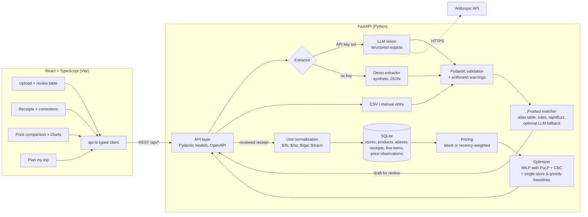

# Grocery Price Optimizer

**Turn grocery receipts into a per-store price database, then find the cheapest way to buy a
shopping list across stores, counting the cost of each extra trip.**

By **Simran Kharbanda**


| Upload and review | Price comparison | Trip plan |
|---|---|---|
|  |  |  |

> **All data in this repo is synthetic.** The receipts and prices under `data/synthetic/` are
> generated by `scripts/generate_synthetic_data.py`. Store names are only labels, and the prices
> are not real store prices. So every number below describes how the methods behave. None of
> them is a real-world saving.

## Summary

| | |
|---|---|
| **Problem** | Prices differ between stores, but receipts are hard to compare: package sizes differ, some items are priced by weight, names are abbreviated, and each extra store costs time and gas. |
| **Approach** | LLM vision extraction with a JSON schema, then a person reviews the draft, then hybrid product matching (aliases → rules → fuzzy → optional LLM), unit-price normalization, and a mixed-integer program that chooses the stores. |
| **Stack** | Python · FastAPI · Pydantic · SQLite · PuLP/CBC · rapidfuzz · Anthropic API · React 19 + TypeScript (Vite) · Recharts |
| **Key results** *(synthetic)* | Over 500 random lists at a $2 trip cost, the plan saves **8.2% vs the best single store** and **5.4% vs per-item greedy**, in about 20 ms per plan. Rules + fuzzy matching auto-matches **106/106** synthetic names and **34/37** hand-written ones, with **0 wrong auto-matches**. |
| **Quality** | 123 pytest tests (no network needed), a brute-force cross-check of the optimizer, a TypeScript type check, and three eval scripts. |

## The problem

I shop at several stores (Lidl, Trader Joe's, Aldi, Giant, Target) and keep the receipts. The
prices are hard to compare by eye:

- **Package sizes differ.** 12 eggs vs 18, a 16 oz pack vs a 24 oz pack.
- **Some items are priced by weight.** For example `2.13 lb @ 0.69/lb`.
- **Receipt names are abbreviated.** `TJ ORG BANANAS`, `BNLS SKNLS CHKN BRST`.
- **Trips cost something.** The cheapest store for each item is often not the cheapest plan
  overall.

The app solves this in three steps:

1. **Receipts → data.** A photo or PDF of a receipt becomes structured line items.
2. **Data → comparable prices.** Each line maps to a canonical product, like "banana
   (organic)", with a price in a comparable unit ($/lb, $/oz, $/gal or $/each).
3. **Prices → plan.** It picks a store for each item so that item costs plus trip costs are as
   low as possible.

## Architecture



Uploading happens in two steps on purpose. `POST /api/receipts/extract` returns a **draft** with
suggested matches and saves nothing. The user fixes the draft in an editable table, and then
`POST /api/receipts` saves it. That way a model error can't silently get into the price
database.

## How it works

### 1. Receipt extraction · `extraction.py`, `schemas.py`

- The image (PNG, JPEG, WEBP or GIF) or PDF goes to the Anthropic API as a base64 `image` or
  `document` block. The model ID comes from
  `GROCERY_LLM_MODEL`, which is required in real mode.
- **Structured outputs.** A JSON schema in `output_config.format` makes sure the reply is valid
  JSON with a store, a date, line items (`raw_name`, `quantity`, `unit`, `size`, `unit_price`,
  `line_total`) and a `total`.
- **Pydantic validation** covers what the schema can't: `quantity > 0`, real calendar dates
  and the allowed units. A test checks that the schema and the Pydantic models list the same
  fields.
- **Soft consistency checks.** Warnings flag a line where `quantity × unit_price ≠ line_total`,
  or a receipt that doesn't add up to its total. They're warnings rather than errors because
  coupons, tax and deposits are normal.
- **Error handling.** Refusals, `max_tokens` cut-offs, and auth, rate-limit and connection
  failures each become a clear `ExtractionError`.
- **Two ways in without a key.** You can use CSV or manual entry (with row-numbered errors). Or
  use demo mode, where the bundled synthetic images return their ground-truth JSON so the whole
  app works offline.

### 2. Normalization and product matching · `units.py`, `matching.py`

**Units.** Each unit belongs to a dimension (weight, volume or count) and has a factor to that
dimension's base unit. `parse_size` handles strings like `16 oz`, `1/2 gal`, `2 x 8oz`,
`52 FL OZ`, `12 ct` and `dozen`. There are three pricing cases:

1. Sold by weight (`2.13 lb @ 0.69/lb`): convert the per-unit price.
2. Sold as a package with a size (a `1.5 lb` pack for $6.00): divide to get $4.00/lb.
3. Sold as a package with no size: the price is only comparable for "each" products. For
   anything else the line is flagged "size needed".

**Matching runs the cheapest and most reliable step first:**

1. **Alias table.** An exact lookup of names already mapped. A manual choice is saved with
   `source = 'user'`, and automation never overwrites it.
2. **Rules.** Expand abbreviations (`ORG` → organic, `BNLS` → boneless) and strip store brands
   and sizes.
3. **Fuzzy match (rapidfuzz).** The score averages `token_set_ratio` and `token_sort_ratio`.
   A mismatch between organic and conventional costs 20 points, because their prices differ a
   lot.
4. **Optional LLM fallback** (`llm_matching.py`). For low-scoring names, the model picks one of
   the top 5 candidates or `NONE`. A schema `enum` stops it from inventing products, and these
   matches still go to review.
5. **Anything still unmatched** goes to the review queue with suggestions filled in.

Scores of 85 or higher are accepted automatically. Everything else needs review.

### 3. Price database · `db.py`, `pricing.py`

The SQLite tables are `stores`, `products`, `aliases`, `receipts`, `line_items` (raw lines) and
`price_observations` (a comparable $/unit per matched line). Raw lines and observations are
kept separate, so re-matching a line only recomputes its observation.

A (product, store) price is either the **latest** observation or a **recency-weighted** mean
with weight `0.5 ** (age_days / 30)`. The 30-day half-life follows price changes without letting
one sale take over.

### 4. Optimizer · `optimizer.py`

A small facility-location mixed-integer program:

```
x[i,s] in {0,1}   buy item i at store s   (only if store s has a price for i)
y[s]   in {0,1}   visit store s

minimize   sum qty_i * price[i,s] * x[i,s]  +  sum trip_cost[s] * y[s]
s.t.       sum_s x[i,s] = 1       every item some allowed store carries
           x[i,s] <= y[s]         buy only at stores you visit
           sum_s y[s] <= K        optional max number of stores
```

It's solved with PuLP and CBC and compared against two baselines:

- **Cheapest single store:** counts only stores that carry every item. If no store carries
  everything, the app says so.
- **Per-item greedy:** buy each item at its cheapest store, then add the trip costs.

Items no allowed store carries are reported as unavailable. Trip cost can be one number for
all stores or set per store.

### 5. REST API · `api/app.py`, `api/models.py`

| Method | Path | Purpose |
|---|---|---|
| GET | `/api/health` | status, demo mode, model |
| POST | `/api/receipts/extract` | image/PDF → draft with suggested matches |
| POST | `/api/receipts/parse-csv` | CSV text → drafts |
| POST | `/api/receipts` | save a reviewed draft (manual picks become aliases) |
| GET / DELETE | `/api/receipts`, `/api/receipts/{id}` | list or delete receipts |
| GET | `/api/receipts/{id}/items`, `/api/line-items` | saved lines with comparable prices |
| PATCH | `/api/line-items/{id}` | re-match a saved line (price is recomputed) |
| GET / PUT / DELETE | `/api/aliases` | the editable alias table |
| GET / POST | `/api/products` | catalog and custom products |
| GET | `/api/prices`, `/api/prices/history` | product × store table and history |
| POST | `/api/plan` | optimal plan, both baselines and the savings |
| POST | `/api/demo/load` | load the synthetic demo receipts |

OpenAPI docs are served at `http://localhost:8000/docs`. The extraction endpoint is a plain
(sync) function on purpose: FastAPI runs it in a worker thread, so the blocking model call
doesn't stall the event loop.

### 6. Frontend · `web/`

React 19 + TypeScript + Vite with plain CSS. All requests go through `web/src/api.ts`, whose
types mirror the Pydantic models.

- **Upload:** drag and drop (or CSV) into an editable review table with match badges,
  suggestions, arithmetic warnings and a "new product" form.
- **Receipts:** saved receipts, with in-place re-matching of any line.
- **Prices:** a product × store table with the cheapest store highlighted, a latest/weighted
  toggle, and bar and history charts (lazy-loaded).
- **Plan my trip:** a list builder, store filters, trip cost and max stores, then per-store buy
  lists for the optimal plan and both baselines.

## Results

*All results are measured on the bundled **synthetic** data. They show how the methods behave,
not real-world savings or accuracy.*

### Optimizer: sample list (15 items, 4 stores) · `make benchmark`

| Trip cost per store | MILP plan | Cheapest single store | Per-item greedy | MILP saves vs single store | Stores used |
|---|---|---|---|---|---|
| $0 | $49.57 | $53.17 | $49.57 | $3.60 (6.8%) | 3 |
| $2 | $53.83 | $55.17 | $55.57 | $1.34 (2.4%) | 2 |
| $5 | $58.17 | $58.17 | $64.57 | $0.00 (0.0%) | 1 |

As trip cost goes up, the best plan drops from three stores to one. Greedy becomes the worst
option: at $5 per trip it costs $6.40 more than the optimum.

### Optimizer: 500 random lists of 8–15 products (seed 42)

Savings vs a single store are averaged only over the 28% of lists that one store can fill
completely.

| Trip cost | Mean savings vs single store | Max | Mean savings vs greedy | Avg stores in plan | Time per `optimize()` |
|---|---|---|---|---|---|
| $0 | 13.7% | 36.4% | 0.0% | 3.66 | ~17 ms |
| $2 | 8.2% | 30.9% | 5.4% | 1.90 | ~20 ms |
| $5 | 5.0% | 24.1% | 13.3% | 1.84 | ~19 ms |

The time includes the MILP and both baselines, measured on a laptop.

### Product matching · `make eval-matching`

This uses the catalog only: no aliases and no LLM.

| Label set | Matcher | n | Correct | Wrong auto-match | Sent to review |
|---|---|---|---|---|---|
| Synthetic receipt names | rules + fuzzy | 106 | 106 | 0 | 0 |
| Synthetic receipt names | fuzzy only | 106 | 48 | 1 | 57 |
| Hand-written receipt-style strings | rules + fuzzy | 37 | 34 | 0 | 3 |
| Hand-written receipt-style strings | fuzzy only | 37 | 28 | 1 | 8 |

The synthetic set is optimistic, because the generator and the rules were written together.
The hand-written set was written separately. It includes 5 lines that should *not* be
auto-matched, such as non-grocery items and "ORG WHOLE MILK", which has no organic version in
the catalog. For the 3 names sent to review, the correct product was the top suggestion every
time. The ablation shows that **the rules step is what makes auto-matching work** on
abbreviated names.

### Extraction eval harness · `make eval`

The harness scores deliberately corrupted "predictions" (dropped lines, a fake `BAG FEE` line,
misread prices, missing sizes) against ground truth. It gives line-item F1 = 0.976, unit_price
F1 = 0.932 and total match rate = 0.75, which shows the harness catches each type of error.
**Real extraction accuracy hasn't been measured yet.** `make eval-llm` runs it on the
synthetic images and needs an API key.

## Design decisions

- **MILP instead of greedy.** Greedy is only optimal when trips are free. Once trips cost
  something, the choices depend on each other: moving eggs to Lidl only pays off if you're going
  to Lidl anyway. The integer program solves this exactly, supports "at most K stores" and
  per-store trip costs, and runs in milliseconds at this size. A brute-force test checks it on
  random instances.
- **Hybrid matching instead of LLM-only.** Receipt names repeat, so an alias lookup is free and
  exact. Rules and fuzzy matching are deterministic, cost nothing and are easy to debug. The LLM
  only sees what's left over and is limited to real catalog products. Manual fixes become
  aliases, so the system improves the more it's used.
- **Structured outputs plus Pydantic.** The schema guarantees JSON you can parse, with no regex
  scraping. Pydantic enforces value ranges and gives the same typed object to every way data
  comes in (LLM, CSV, demo).
- **Draft → review → save.** One bad price silently skews every future plan, so a person
  confirms each receipt before it counts.
- **SQLite.** One user, one file, no setup, and real SQL (foreign keys, cascades, upserts). The
  data layer is a single class, so moving to Postgres would be a contained change.
- **App factory with dependency injection.** `create_app(db_path, extractor)` lets tests use a
  temporary database and a fake model client, so the whole API is tested without a network.

## Limitations and future work

| Limitation | Next step |
|---|---|
| Quantities are continuous, so the optimizer can buy "32 oz of pasta" where only 24 oz boxes exist | Integer package counts for each available size |
| Prices come only from your own receipts, so a store you haven't shopped at "doesn't sell" the item | Import public price data |
| Flat trip cost | Store locations and real travel time |
| Small catalog (32 products) | Embedding-based candidate search before the LLM fallback |
| Extraction accuracy on real, crumpled thermal receipts isn't measured | A hand-labeled real receipt set (see below) |
| Single-user local app with no auth | Docker Compose, CI, Postgres and user accounts |

Other smaller points: store-brand and name-brand products share one canonical product, and
branches of the same chain share prices.

## Running it

You need Python 3.11+ and Node 20.19+ or 22.12+.

```bash
make setup        # create .venv, install the package, npm install in web/
make dev          # API on :8000 + React on :5173 (Ctrl+C stops both)
```

Open http://localhost:5173 and click **Load synthetic demo data**.

| Command | What it does |
|---|---|
| `make serve` | build the React app and serve it from FastAPI at :8000 |
| `make api` | API only (docs at :8000/docs) |
| `make demo && make plan` | terminal only: load demo data and print a trip plan |
| `make test` | 123 Python tests, no network or key needed |
| `make typecheck` / `make build` | TypeScript check / production build |
| `make eval` · `make eval-matching` · `make benchmark` | the evals behind the results above |
| `make eval-llm` | real LLM extraction on the synthetic images (needs a key and a model ID) |

**Demo mode vs real mode.** If `ANTHROPIC_API_KEY` isn't set, the app runs fully offline on the
synthetic data, and CSV entry, review, prices and planning all work. With a key and a model ID
set (`GROCERY_LLM_MODEL`), uploads go through the model. Each receipt is one API call. Set `GROCERY_LLM_MATCHING=1` to turn on the LLM
matching fallback, or `GROCERY_DEMO=1` to force demo mode.

### Adding your own receipts

- **Photos or PDFs:** set `ANTHROPIC_API_KEY` and `GROCERY_LLM_MODEL`, run `make dev`, drag the files onto Upload, review the draft,
  then click **Save receipt**. From the CLI:
  `.venv/bin/python -m grocery_optimizer.cli ingest photo1.jpg photo2.pdf`
- **CSV (no key):** use the Upload page, or run
  `.venv/bin/python -m grocery_optimizer.cli ingest my_receipts.csv`. The columns are
  `store,date,raw_name,quantity,unit,size,unit_price,line_total,total`, and rows with the same
  store and date form one receipt.
- **Measure extraction on your receipts:** add a ground-truth JSON next to each image and run
  `evals/extraction_eval.py --gold my_gold/ --images my_images/ --extractor llm`.

The database is `data/grocery.db` (set `GROCERY_DB` to change it). `data/my_receipts/` and
`*.db` are in `.gitignore`.

## Project layout

```
src/grocery_optimizer/
  schemas.py        Receipt / LineItem models + JSON schema
  extraction.py     vision extractor, demo extractor, error handling
  llm_matching.py   optional LLM fallback for product matching
  manual_entry.py   CSV -> receipts
  units.py          size parsing and comparable unit prices
  catalog.py        canonical products (data/catalog.json)
  matching.py       alias table + rules + rapidfuzz matcher
  db.py             SQLite price database
  pricing.py        latest / recency-weighted prices
  optimizer.py      MILP (PuLP/CBC) + single-store and greedy baselines
  planning.py       DB prices + shopping list -> optimizer
  ingest.py         extraction -> matching -> DB glue, demo loader
  evaluation.py     extraction metrics (P/R/F1)
  cli.py            command-line interface
  api/              FastAPI app + request/response models
web/                React + TypeScript frontend (Vite)
evals/              extraction eval, matching eval, optimizer benchmark
scripts/            synthetic data generator
data/synthetic/     SYNTHETIC receipts (JSON + PNG) and match labels
tests/              pytest suite
```

## Author

**Simran Kharbanda**
