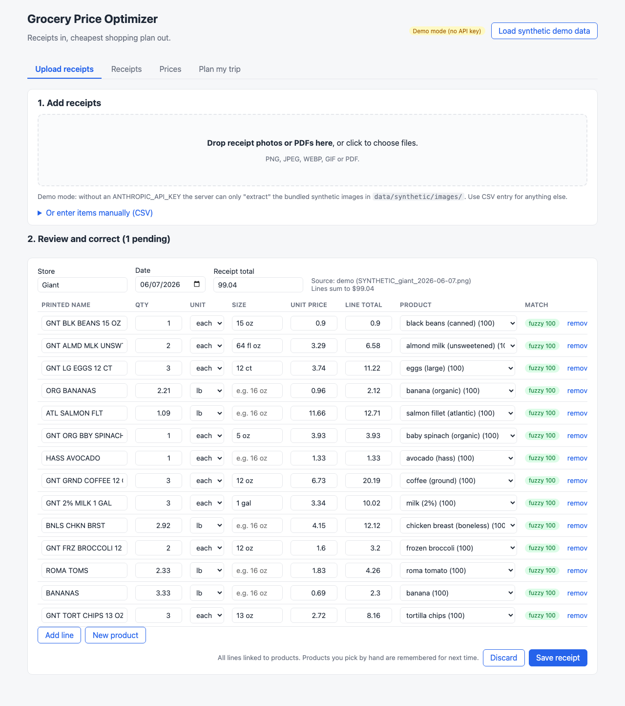
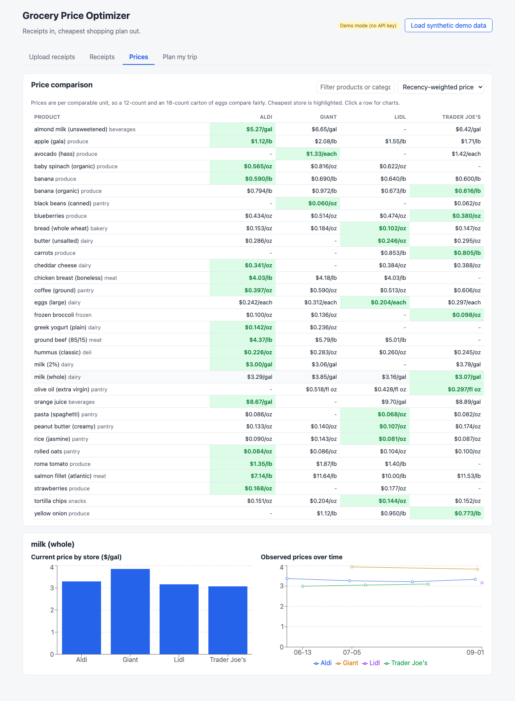
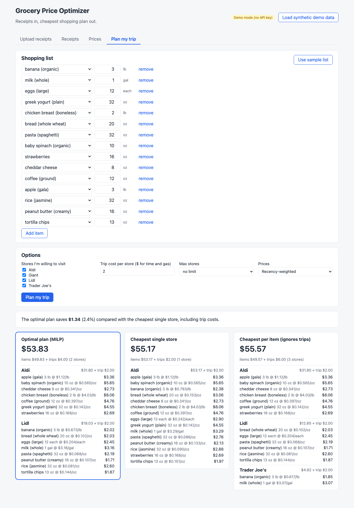
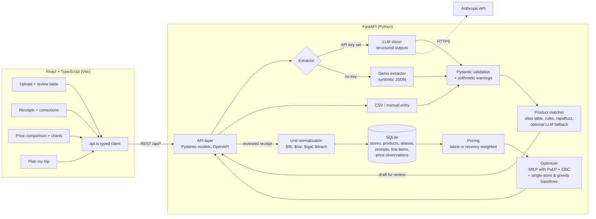

# Grocery Price Optimizer

A full-stack app that reads grocery receipts, builds a price database per store, and tells you
what to buy where for a given shopping list.

- **Backend:** Python, FastAPI, SQLite, PuLP (MILP with the CBC solver), rapidfuzz, Pydantic
- **AI:** LLM vision with structured outputs (JSON schema) for receipt extraction, plus an
  optional the LLM fallback for product matching
- **Frontend:** React + TypeScript (Vite), Recharts
- **Quality:** 122 pytest tests, a TypeScript type check, and eval scripts for extraction,
  matching and the optimizer

> All sample data in this repo is **synthetic**. The receipts, prices and file names under
> `data/synthetic/` are generated by `scripts/generate_synthetic_data.py`. Store names are used
> only as labels, and the prices are not real store prices.

| Upload and review | Price comparison | Trip plan |
|---|---|---|
|  |  |  |

(The screenshots show the app running on the synthetic demo data.)

## The problem

I shop at several stores (Lidl, Trader Joe's, Aldi, Giant, Target...) and keep the receipts.
Prices differ a lot between stores, but they are hard to compare by eye. Package sizes differ
(12 eggs vs 18, 16 oz vs 24 oz), some items are priced by weight, and receipt names are
abbreviated ("TJ ORG BANANAS", "BNLS SKNLS CHKN BRST"). Also, going to more stores costs time
and gas, so the cheapest store for each item is not always the best plan.

The app does three things:

1. **Receipts to data.** It turns a photo or PDF of a receipt into structured line items.
2. **Data to comparable prices.** It maps each line to a canonical product, like
   "banana (organic)", and converts the price to a comparable unit ($/lb, $/oz, $/gal, $/each).
3. **Prices to a plan.** It picks a store for each item on your list, so that item costs plus
   per-store trip costs are as low as possible.

## Architecture



The upload flow has two steps on purpose. `POST /api/receipts/extract` returns a **draft**
with suggested product matches, and nothing is saved yet. The user fixes anything that is wrong
in an editable table. Then `POST /api/receipts` saves it. This way, a model error cannot quietly
enter the price database.

## How each part works

### 1. Receipt extraction (`extraction.py`, `schemas.py`)

- The image (PNG/JPEG/WEBP/GIF) or PDF is sent to the LLM as a base64 `image` or `document`
  block. The default model is `<model-id>`, and you can override it with
  `GROCERY_LLM_MODEL`.
- **Structured outputs:** the request passes a JSON schema in `output_config.format`, so the
  reply is always valid JSON in the right shape: store, date, line items (`raw_name`,
  `quantity`, `unit`, `size`, `unit_price`, `line_total`) and `total`.
- The JSON is then validated with **Pydantic** (`Receipt` / `LineItem`). This enforces rules
  that the schema does not express well, such as `quantity > 0`, a real calendar date and the
  allowed units. A unit test checks that the hand-written schema and the Pydantic models list the
  same fields.
- **Soft checks** (`consistency_warnings`) flag lines where `quantity x unit_price` does not
  equal `line_total`, and receipts whose lines do not add up to the printed total. These are
  warnings shown in the review UI, not errors, because real receipts have coupons, tax and
  deposits.
- **Error handling:** refusals, `max_tokens` cut-offs, auth, rate-limit and connection errors
  each become a clear `ExtractionError`. Requests turn on the API's server-side refusal
  fallback (`fallbacks: "default"`).
- **Two other ways in, so you never need a key:**
  - **CSV / manual entry** (`manual_entry.py`): one row per item, grouped into receipts by
    store and date. It has row-numbered error messages.
  - **Demo mode:** when `ANTHROPIC_API_KEY` is not set, a `DemoReceiptExtractor` "extracts"
    the bundled synthetic receipt images by returning their ground-truth JSON. The whole app
    still works end to end. Other images get a clear message telling you to use CSV or set a key.

### 2. Normalization and product matching (`units.py`, `matching.py`)

**Units.** Every unit belongs to one dimension (weight, volume or count) and has a factor to
that dimension's base unit. For example, 16 oz is 1 lb, 128 fl oz is 1 gal, and "12 ct" is 12
each. `parse_size` reads strings like `16 oz`, `1/2 gal`, `2 x 8oz`, `52 FL OZ`, `12 ct` and
`dozen`. `comparable_unit_price` then handles three cases:

1. Sold by weight (`2.13 lb @ 0.69/lb`): convert the per-unit price.
2. Sold per package with a size (`1.5 lb` pack for $6.00): divide by the size, giving $4.00/lb.
3. Sold per package with no size: this is only comparable for "each" products. Otherwise no
   price observation is stored, and the Receipts page shows "size needed" for that line.

**Matching is a hybrid that runs the cheapest, most reliable step first:**

1. **Alias table:** an exact lookup of names that were already mapped. When a user picks a
   product by hand, that choice is saved with `source = 'user'`, and automation never
   overwrites it.
2. **Rules:** expand receipt abbreviations (`ORG` to organic, `BNLS` to boneless, `WHL` to
   whole), and strip store brands (`TJ`, `GNT`, `Simply Nature`) and package sizes.
3. **Fuzzy match (rapidfuzz):** the score is the average of `token_set_ratio` and
   `token_sort_ratio` against the canonical names and synonyms. Organic and conventional
   products are kept apart on purpose, with a 20-point penalty when they do not match, because
   their prices differ a lot.
4. **Optional LLM fallback** (`llm_matching.py`): for names below the threshold, the LLM picks
   one of the top 5 fuzzy candidates or `NONE`. The schema `enum` means it cannot invent a
   product. Matches made this way are still flagged for review.
5. **Otherwise the name is unmatched** and goes to the review queue, with the top suggestions
   pre-filled.

Names scoring at least 85 are accepted automatically. Anything else needs review.

### 3. Price database (`db.py`, `pricing.py`)

The SQLite tables are `stores`, `products`, `aliases`, `receipts`, `line_items` (the raw
extracted lines) and `price_observations` (one comparable $/unit per matched line, with its
date). Raw lines and observations are kept apart. Re-matching a line only needs its
observation to be recomputed.

The current price for each (product, store) is either the **latest** observation or a
**recency-weighted** mean. The weight is `0.5 ** (age_days / 30)`, so an observation 30 days
older than the newest one counts half. This smooths out one-off sales without letting old
prices take over.

### 4. Optimizer (`optimizer.py`)

This is a small facility-location style mixed-integer program:

```
x[i,s] in {0,1}   buy item i at store s   (only if store s has a price for i)
y[s]   in {0,1}   visit store s

minimize   sum qty_i * price[i,s] * x[i,s]  +  sum trip_cost[s] * y[s]
s.t.       sum_s x[i,s] = 1       every item that some allowed store carries
           x[i,s] <= y[s]         can only buy at a store you visit
           sum_s y[s] <= K        optional max number of stores
```

It is solved with PuLP and CBC (CBC is included in the PuLP wheel). The same inputs go to two
baselines:

- **Cheapest single store:** one trip, and only stores that carry every item on the list count.
  If no store carries everything, the app says so instead of comparing unlike totals.
- **Per-item greedy:** buy each item at its cheapest store and add the trip costs afterwards.

Items that no allowed store carries are listed as unavailable. Trip cost can be one number or
set per store.

### 5. REST API (`api/app.py`, `api/models.py`)

| Method | Path | What it does |
|---|---|---|
| GET | `/api/health` | status, demo mode, model |
| POST | `/api/receipts/extract` | upload an image/PDF and get a draft with suggested matches |
| POST | `/api/receipts/parse-csv` | CSV text to drafts |
| POST | `/api/receipts` | save a reviewed draft (lines the user picked by hand become aliases) |
| GET / DELETE | `/api/receipts`, `/api/receipts/{id}` | list or delete receipts |
| GET | `/api/receipts/{id}/items`, `/api/line-items` | saved lines with their comparable prices |
| PATCH | `/api/line-items/{id}` | correct a saved line's product (its price is recomputed) |
| GET / PUT / DELETE | `/api/aliases` | the alias table, which the user can edit |
| GET / POST | `/api/products` | the catalog, plus custom products |
| GET | `/api/prices`, `/api/prices/history` | product x store table and price history |
| POST | `/api/plan` | the optimal plan, both baselines and the savings |
| POST | `/api/demo/load` | load the synthetic demo receipts |

Interactive OpenAPI docs are at `http://localhost:8000/docs`. Each request opens its own SQLite
connection through a FastAPI dependency. The extraction endpoint is a plain (sync) function
on purpose: FastAPI runs it in a worker thread, so the blocking model call does not stall the
event loop.

### 6. Frontend (`web/`)

React 19 + TypeScript + Vite with plain CSS. Every network call goes through `web/src/api.ts`,
whose types mirror the Pydantic models. There are four pages:

- **Upload receipts:** drag and drop (or CSV), then an editable review table with match
  badges, suggested products, arithmetic warnings, add or remove lines, and a "new product" form.
- **Receipts:** saved receipts, and re-matching a saved line in place.
- **Prices:** a product x store table with the cheapest store highlighted, a filter, a
  latest/weighted toggle, and a bar chart plus a price-history chart. This page is lazy-loaded
  so the charts library does not slow down the first page load.
- **Plan my trip:** a shopping list builder (or the sample list), store checkboxes, trip cost,
  max stores, then per-store buy lists for the optimal plan and both baselines, with the
  savings.

## Running it

You need Python 3.11+ and Node 20.19+ or 22.12+, which Vite requires (I developed it with Python 3.14 and Node 24 LTS).

```bash
make setup        # creates .venv, pip installs the package, runs npm install in web/
make dev          # API on :8000 + React dev server on :5173 (Ctrl+C stops both)
```

Open http://localhost:5173 and click **Load synthetic demo data**.

Other ways to run it:

```bash
make serve        # builds the React app and serves it from FastAPI at http://localhost:8000
make api          # API only (docs at http://localhost:8000/docs)
make demo && make plan   # terminal only: load the demo data and print a trip plan
```

Without Make, the commands are `python3 -m venv .venv && .venv/bin/pip install -e ".[dev]"`,
`cd web && npm install`, then `.venv/bin/uvicorn --factory grocery_optimizer.api.app:create_app --port 8000`
and `cd web && npm run dev`.

### Demo mode (no API key)

If `ANTHROPIC_API_KEY` is not set, the app runs fully offline:

- "Load synthetic demo data" loads 16 synthetic receipts from 4 stores.
- Uploading any image from `data/synthetic/images/` returns its ground-truth extraction.
- CSV entry, review, prices and planning all work normally.
- You can force demo mode with a key set by using `GROCERY_DEMO=1`.

### Real mode (with the LLM)

```bash
export ANTHROPIC_API_KEY=sk-ant-...
make dev
```

Uploads now go to the LLM. Each receipt is one API call and costs API credits. To also use the
LLM matching fallback for names the fuzzy matcher is unsure about, also set
`GROCERY_LLM_MATCHING=1`.

## Tests and evals

```bash
make test          # 122 Python tests, no network and no API key needed
make typecheck     # TypeScript type check (tsc --noEmit)
make build         # type check + production build of the frontend
make eval          # extraction eval harness on the synthetic example
make eval-matching # matching accuracy + rules-off ablation
make benchmark     # optimizer vs baselines on the synthetic price DB
make eval-llm   # real the LLM extraction on the synthetic PNGs (needs a key, costs money)
```

The tests cover:

- **unit parsing and conversions**
- **matching:** organic vs conventional, aliases win over fuzzy, the LLM fallback is called only
  below the threshold and cannot return a product outside the catalog
- **DB:** cascades, user aliases are protected, re-matching recomputes the observation
- **pricing:** a hand-checkable recency-weighted example
- **optimizer:** a hand-checkable case where two stores beat one, a case where the trip cost
  makes one store win, per-store trip costs, missing items, max stores, and a **brute-force
  cross-check on 15 random instances**
- **extraction with a mocked Anthropic client:** the request shape, schema/Pydantic sync,
  invalid JSON, refusal, truncation and connection errors
- **the eval metrics:** a small example you can check by hand
- **the REST API** through FastAPI's `TestClient`, including a full upload, review, save and
  plan flow, and an upload through a mocked the LLM extractor

## Results (all measured on the bundled SYNTHETIC data)

These numbers come from the scripts above, run on synthetic data. They describe how the methods
behave on made-up prices and made-up receipt text. They are **not** real-world savings or
accuracy.

**Optimizer, sample shopping list (15 items, 4 synthetic stores)** from `make benchmark`:

| Trip cost per store | MILP plan | Cheapest single store | Per-item greedy | MILP saves vs single store | Stores used |
|---|---|---|---|---|---|
| $0 | $49.57 | $53.17 | $49.57 | $3.60 (6.8%) | 3 |
| $2 | $53.83 | $55.17 | $55.57 | $1.34 (2.4%) | 2 |
| $5 | $58.17 | $58.17 | $64.57 | $0.00 (0.0%) | 1 |

As trip cost rises, the best plan moves from three stores to one. The per-item greedy plan
(buy everything at its cheapest store) becomes the worst option: at $5 per trip it costs $6.40
more than the optimum.

**Optimizer, 500 random lists of 8-15 products** (seed 42). Savings vs the single store are
averaged only over the 28% of lists where one store carries every item.

| Trip cost | Mean savings vs single store | Max | Mean savings vs greedy | Avg stores in plan | Avg time per `optimize()` call |
|---|---|---|---|---|---|
| $0 | 13.7% | 36.4% | 0.0% | 3.66 | ~17 ms |
| $2 | 8.2% | 30.9% | 5.4% | 1.90 | ~20 ms |
| $5 | 5.0% | 24.1% | 13.3% | 1.84 | ~19 ms |

(The time covers the MILP and both baselines, measured on my laptop.)

**Product matching** (catalog only, no aliases, no LLM) from `make eval-matching`:

| Label set | Matcher | n | Correct | Wrong auto-match | Sent to review |
|---|---|---|---|---|---|
| Synthetic receipt names | rules + fuzzy | 106 | 106 | 0 | 0 |
| Synthetic receipt names | fuzzy only | 106 | 48 | 1 | 57 |
| Hand-written receipt-style strings | rules + fuzzy | 37 | 34 | 0 | 3 |
| Hand-written receipt-style strings | fuzzy only | 37 | 28 | 1 | 8 |

The synthetic set is optimistic, because I wrote the generator and the abbreviation rules
together. The hand-written set was written separately and includes 5 lines that should *not* be
auto-matched (non-grocery items, and "ORG WHOLE MILK", which the catalog has no organic version
of). For the 3 hand-written names sent to review ("BANANAS YELLOW", "HUMMUS ORIGINAL",
"COFFEE MEDIUM ROAST GROUND"), the correct product was the top suggestion. The ablation shows
that the rules step is what makes auto-matching work on abbreviated names.

**Extraction eval harness** from `make eval`. The bundled example scores synthetic
"predictions" with errors injected on purpose (dropped lines, a fake "BAG FEE" line, misread
prices, dropped sizes) against the ground truth. Line-item F1 = 0.976, unit_price F1 = 0.932,
and total match rate = 0.75. These numbers only show that the harness catches each kind of
error. **I have not measured the LLM's real extraction accuracy.** To measure it on the synthetic
images, run `make eval-llm` (needs a key). To measure it on real receipts, add hand-labeled
ones (see below).

## Design decisions and tradeoffs

- **Why a MILP instead of greedy?** Greedy is optimal only when trips are free. Once a trip has
  a cost, the choices depend on each other: moving eggs to Lidl is only worth it if you are going
  to Lidl anyway. The integer program handles this exactly, and it also handles "at most K
  stores" and per-store trip costs. At this size (tens of items, a handful of stores) CBC solves
  it in milliseconds, so there is no reason to use a heuristic. A brute-force test checks it on
  random instances.
- **Why hybrid matching instead of just an LLM?** Most receipt names repeat, so an alias lookup
  is free and exact. Rules plus fuzzy matching are deterministic, cost nothing, run offline and
  are easy to debug, and the ablation above shows how much the rules add. The LLM runs only on
  the few names left over, and the `enum` limits its answer to real catalog products. Every
  uncertain match goes to a human, and their fix becomes an alias, so the system gets better with
  use.
- **Why structured outputs plus Pydantic?** The JSON schema makes the model return parseable
  JSON in the right shape, so there is no regex scraping of free text. Pydantic then checks
  what a schema cannot (value ranges, dates) and gives one typed object to every ingestion path
  (the LLM, CSV, demo). The arithmetic checks are soft warnings, because discounts and tax make
  hard rules wrong.
- **Why draft, then review, then save?** Extraction and matching will sometimes be wrong. A
  wrong price in the database quietly skews every future plan, so a person confirms each receipt
  before it counts.
- **Why SQLite?** One user, one file, zero setup, and real SQL (foreign keys, cascades,
  upserts). The data layer is a single class, so moving to Postgres later would be contained.
- **Why recency weighting?** Prices drift and sales come and go. A 30-day half-life follows
  changes without letting one sale price take over.
- **Why an app factory plus dependency injection?** `create_app(db_path, extractor)` lets tests
  use a temporary database and a fake the LLM client, so the whole API is tested with no network.

## Limitations

- Quantities are continuous. The optimizer can buy "32 oz of pasta" at a store that sells
  24 oz boxes, so package rounding is not modeled.
- Prices come only from your own receipts. If you have not bought an item at a store, the app
  treats that store as not selling it.
- Store brand and name-brand products are treated as the same canonical product.
- The catalog is small (32 products). New products can be added from the UI or in
  `src/grocery_optimizer/data/catalog.json`.
- Store names are normalized with fuzzy matching ("TRADER JOE'S #552" becomes "Trader Joe's").
  Different branches of one chain share prices.
- There are no user accounts or authentication. This is a single-user local app.
- I have not measured extraction accuracy on real receipts. The synthetic receipt images are
  clean renders and much easier than crumpled thermal paper.

## Future work

- Model package sizes in the optimizer, as an integer number of packages per available size.
- An embedding-based candidate search for large catalogs, before the LLM fallback.
- Use the Message Batches API for bulk back-filling of old receipts (about half the cost).
- Store locations and real travel time instead of a flat trip cost.
- Sale and price-drop alerts built on the price history.
- Docker Compose, CI (GitHub Actions running `make check`), and Postgres for multi-user use.

## How to add your own receipts

1. **With the LLM:** `export ANTHROPIC_API_KEY=...`, run `make dev`, and drag photos or PDFs
   onto the Upload page. Check the review table (fix any product or number), then click
   **Save receipt**. Products you pick by hand are remembered for next time.
2. **Without a key:** open "Or enter items manually (CSV)" on the Upload page, or use the CLI:
   ```bash
   .venv/bin/python -m grocery_optimizer.cli ingest my_receipts.csv
   ```
   CSV columns: `store,date,raw_name,quantity,unit,size,unit_price,line_total,total`.
   `size` and `total` can be blank. Rows with the same store and date form one receipt.
3. **From the terminal with the LLM:** `.venv/bin/python -m grocery_optimizer.cli ingest photo1.jpg photo2.pdf`
   (lines that need review are printed).
4. **Evaluate extraction on your own receipts:** put the images in a folder, write the
   ground-truth JSON for each one (same file name, `.json`, same schema as
   `data/synthetic/receipts/`), then run
   ```bash
   .venv/bin/python evals/extraction_eval.py --gold my_gold/ --images my_images/ --extractor llm
   ```
   Keep personal receipts out of git: `data/my_receipts/` and `*.db` are already in `.gitignore`.

Your database lives at `data/grocery.db` (override it with `GROCERY_DB=/path/to.db`).

## Project layout

```
src/grocery_optimizer/
  schemas.py        Receipt / LineItem models + JSON schema for the LLM
  extraction.py     LLM vision extractor, demo extractor, error handling
  llm_matching.py   optional the LLM fallback for product matching
  manual_entry.py   CSV -> receipts
  units.py          size parsing and comparable unit prices
  catalog.py        canonical products (data/catalog.json)
  matching.py       alias table + rules + rapidfuzz matcher
  db.py             SQLite price database
  pricing.py        latest / recency-weighted prices
  optimizer.py      MILP (PuLP/CBC) + single-store and greedy baselines
  planning.py       DB prices + shopping list -> optimizer
  ingest.py         extraction -> matching -> DB glue, demo loader
  evaluation.py     extraction metrics (P/R/F1)
  cli.py            command-line interface
  api/              FastAPI app + request/response models
web/                React + TypeScript frontend (Vite)
evals/              extraction eval, matching eval, optimizer benchmark
scripts/            synthetic data generator
data/synthetic/     SYNTHETIC receipts (JSON + PNG) and match labels
tests/              pytest suite
```
